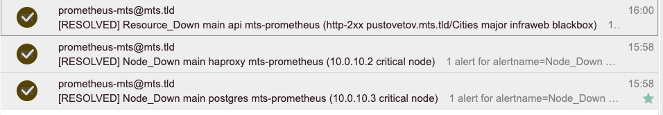

# Входные данные

3 ноды pgsq/etcd/patroni (все 3 сервиса на одной ноде)\
1 нода haproxy\
1 нода prometheus/alertmanager\
Веб-приложение в k8s с данными, отдающие список городов по запросу http://pustovetov.mts.tld/Cities \
_NB! нужно добавить внешний IP ингресса в hosts, иначе nxdomain :)_

# 1. Отключение узла

**Описание эксперимента:**\
Отключаем одну ноду кластера СУБД, она же нода etcd, смотрим на состояние кластера pgsql, etcd, проверяем работу сайта и доступность данных по городам/прогнозам 
Отключение ноды произошло в 09:40:43

**Ожидаемые результаты:**\
Отключение одной из ноды в кластере из 3 инстансов не нарушит работу системы, так как кворум соблюден, 2 ноды остаются работать и смогут выбрать нового мастера (pgsql) и лидера (etcd)

**Реальные результаты:**\
Сервис patroni перевыбрал лидера после отключения pgsql02 в течение 1 секунды (бывший мастер)

`Dec 09 09:40:45 svc-psql01 patroni[897]: 2023-12-09 09:40:45,083 WARNING: Request failed to svc-psql02: GET http://10.0.10.4:8008/patr>
Dec 09 09:40:45 svc-psql01 patroni[897]: 2023-12-09 09:40:45,395 INFO: Got response from svc-psql03 http://10.0.10.5:8008/patroni: {"s>
Dec 09 09:40:45 svc-psql01 patroni[897]: 2023-12-09 09:40:45,603 INFO: Software Watchdog activated with 25 second timeout, timing slac>
Dec 09 09:40:45 svc-psql01 patroni[897]: 2023-12-09 09:40:45,615 INFO: promoted self to leader by acquiring session lock
Dec 09 09:40:45 svc-psql01 patroni[897]: 2023-12-09 09:40:45,616 INFO: Lock owner: svc-psql01; I am svc-psql01
Dec 09 09:40:45 svc-psql01 patroni[897]: 2023-12-09 09:40:45,663 INFO: updated leader lock during promote
Dec 09 09:40:45 svc-psql01 patroni[3391661]: server promoting`

Сервис etcd выбрал нового лидера так же буквально сразу

`Dec 09 09:40:43 svc-psql01 bash[798]: {"level":"info","ts":"2023-12-09T09:40:43.277095Z","logger":"raft","caller":"etcdserver/zap_raft.
go:77","msg":"e8a244cec84997e3 [term: 6] received a MsgVote message with higher term from 43c92545ebd24324 [term: 7]"}
Dec 09 09:40:43 svc-psql01 bash[798]: {"level":"info","ts":"2023-12-09T09:40:43.289505Z","logger":"raft","caller":"etcdserver/zap_raft.
go:77","msg":"e8a244cec84997e3 became follower at term 7"}
Dec 09 09:40:43 svc-psql01 bash[798]: {"level":"info","ts":"2023-12-09T09:40:43.289541Z","logger":"raft","caller":"etcdserver/zap_raft.
go:77","msg":"e8a244cec84997e3 [logterm: 6, index: 330, vote: 0] cast MsgVote for 43c92545ebd24324 [logterm: 6, index: 330] at term 7"}
Dec 09 09:40:43 svc-psql01 bash[798]: {"level":"info","ts":"2023-12-09T09:40:43.289555Z","logger":"raft","caller":"etcdserver/zap_raft.
go:77","msg":"raft.node: e8a244cec84997e3 lost leader b8e514f18eb1635 at term 7"}
Dec 09 09:40:43 svc-psql01 bash[798]: {"level":"info","ts":"2023-12-09T09:40:43.291855Z","logger":"raft","caller":"etcdserver/zap_raft.
go:77","msg":"raft.node: e8a244cec84997e3 elected leader 43c92545ebd24324 at term 7"}`

Сайт доступен, данные получаемые из БД по городам и прогнозам так же доступны

**Анализ результатов:**\
Потеря одной из нод кластера pgsql, etcd не нарушает работу веб-приложения, сервис продолжает работать в штатном режиме и отвечать на запросы. Механизм failover отработал мгновенно благодаря сервису patroni для СУБД, а для etcd благодаря протоколу raft
После включения и возвращения в строй pgsql2 кластер остался работать в прежнем режиме, смены лидера etcd и мастера pgsql не произошло

# 2. Имитация частичной потери сети

**Описание эксперимента:**\
Создаем сетевые проблемы на ноде haproxy, чтобы нарушить сетевое соединение до нод указанных в конфигурации, тем самым нарушить проверки liveness хостов, проверить доступность сайта и данных по городам
Создаем сетевые проблемы на одном из хостов pgsql, проверяем нарушится ли работа patroni, etcd, возникнут ли частые перевыбора мастера/лидера, так же проверяем работу сайти доступности данных

**Ожидаемые результаты:**\
Ожидаются частичные проблемы с прогрузкой сайта, возможны ошибки 5хх, ошибки в логах etcd/patroni о таймаутах при соединении с хостом подвергнутым сетевым проблемам

**Реальные результаты:**
* С помощью утилиты blade создал потери пакетов в 50% на хосте с haproxy на 30с (blade create network loss --interface ens160 --percent 50 --timeout 30), как итог не было замечно проблем, haproxy успешно опрашивала бэкенды и не было ошибок, прогрузка сайта и данных не ухудшилась\
Далее создал потери пакетов в 70% (blade create network loss --interface ens160 --percent 70 --timeout 30), как итог проявились проблемы с доступностью бэкендов у haproxy, время ответа сайта сильно выросло от 2s до 13s, связано с тем, что haproxy терял бэкенд и не мог переправить запрос к БД
```
mz-276:kubernetes leonid.pustovetov$ curl -o /dev/null -s -w 'Total: %{time_total}s\n' http://pustovetov.mts.tld/Cities
Total: **1.360637s**
mz-276:kubernetes leonid.pustovetov$ curl -o /dev/null -s -w 'Total: %{time_total}s\n' http://pustovetov.mts.tld/Cities
Total: 7.098094s
mz-276:kubernetes leonid.pustovetov$ curl -o /dev/null -s -w 'Total: %{time_total}s\n' http://pustovetov.mts.tld/Cities
Total: 1.507825s
mz-276:kubernetes leonid.pustovetov$ curl -o /dev/null -s -w 'Total: %{time_total}s\n' http://pustovetov.mts.tld/Cities
Total: **13.510460s**

Dec 09 11:40:22 svc-hp01 haproxy[2216661]: [WARNING]  (2216661) : Server replicas/svc-psql02 is DOWN, reason: Layer4 timeout, check duration: 3001ms. 1 active and 0 backup servers left. 0 sessions active, 0 requeued, 0 remaining in queue.
Dec 09 11:40:28 svc-hp01 haproxy[2216661]: [WARNING]  (2216661) : Server replicas_async/svc-psql02 is DOWN, reason: Layer4 timeout, check duration: 3001ms. 1 active and 0 backup servers left. 0 sessions active, 0 requeued, 0 remaining in queue.
Dec 09 11:40:34 svc-hp01 haproxy[2216661]: [WARNING]  (2216661) : Server replicas_async/svc-psql02 is UP, reason: Layer7 check passed, code: 200, check duration: 1030ms. 2 active and 0 backup servers online. 0 sessions requeued, 0 total in queue.
Dec 09 11:40:40 svc-hp01 haproxy[2216661]: [WARNING]  (2216661) : Server replicas/svc-psql02 is UP, reason: Layer7 check passed, code: 200, check duration: 2ms. 2 active and 0 backup servers online. 0 sessions requeued, 0 total in queue.
```
Выше поднимать потери смысла нет, так как работа сайта сильно деградирует уже при 70%

* С помощью утилиты blade создал потерю пакетов (blade create network drop --destination-ip 10.0.10.3,10.0.10.4,10.0.10.5 --destination-port 2379 --timeout 30) на pgsql01, который является мастером, в результате через 5с patroni на 2 и 3 нодах перевыбрали нового мастера, им стал pgsql03, после восстановления сети pgsql03 остался мастером
```
Dec 09 12:09:37 svc-psql02 patroni[1187]: 2023-12-09 12:09:37,264 INFO: Got response from svc-psql03 http://10.0.10.5:8008/patroni: {"state": "running", "postmaster_start_time": "2023-10-21 13:45:11.367862+00:00", "role": "replica", "server_version": 150004, "xlog": {"received_location": 268435456, "replayed_location": 268435456, "replayed_timestamp": "2023-11-25 04:23:49.820822+00:00", "paused": false}, "timeline": 4, "replication_state": "streaming", "cluster_unlocked": true, "dcs_last_seen": 1702123777, "database_system_identifier": "7285361516954819563", "patroni": {"version": "3.1.2", "scope": "postgres-cluster-mts"}}
Dec 09 12:09:39 svc-psql02 patroni[1187]: 2023-12-09 12:09:39,245 WARNING: Request failed to svc-psql01: GET http://10.0.10.3:8008/patroni (HTTPConnectionPool(host='10.0.10.3', port=8008): Max retries exceeded with url: /patroni (Caused by ConnectTimeoutError(<urllib3.connection.HTTPConnection object at 0x7fb4d6b06f50>, 'Connection to 10.0.10.3 timed out. (connect timeout=2)')))
Dec 09 12:09:39 svc-psql02 patroni[1187]: 2023-12-09 12:09:39,381 INFO: Could not take out TTL lock
Dec 09 12:09:39 svc-psql02 patroni[1187]: 2023-12-09 12:09:39,382 ERROR: watchprefix failed: ProtocolError("Connection broken: InvalidChunkLength(got length b'', 0 bytes read)", InvalidChunkLength(got length b'', 0 bytes read))
Dec 09 12:09:40 svc-psql02 patroni[15211]: server signaled
Dec 09 12:09:40 svc-psql02 patroni[1187]: 2023-12-09 12:09:40,128 INFO: following new leader after trying and failing to obtain lock
Dec 09 12:09:40 svc-psql02 patroni[1187]: 2023-12-09 12:09:40,129 INFO: Lock owner: svc-psql03; I am svc-psql02
Dec 09 12:09:40 svc-psql02 patroni[1187]: 2023-12-09 12:09:40,142 INFO: Local timeline=4 lsn=0/10000000
Dec 09 12:09:40 svc-psql02 patroni[1187]: 2023-12-09 12:09:40,190 INFO: no action. I am (svc-psql02), a secondary, and following a leader (svc-psql03)
```
Haproxy отреагировало на потерю pgsql01, 503 ошибками, сайт при этом продолжал отвечать стабильно, несколько раз ответив с задержкой (был перевыбор мастера) так как haproxy начал уводить трафик на другой мастер pgsq, выбранный patroni (pgsql03)

`Dec 09 12:10:52 svc-hp01 haproxy[2222991]: [WARNING]  (2222991) : Server replicas_async/svc-psql01 is DOWN, reason: Layer7 wrong status, code: 503, info: "Service Unavailable", check duration: 1ms. 2 active and 0 backup servers left. 0 sessions active, 0 requeued, 0 remaining in queue.
`

Patroni на сервере pgsql01 отреагировал логично, временно потеряв доступ до всех etcd в процессе работы blade

`Dec 09 12:20:37 svc-psql01 patroni[897]: 2023-12-09 12:20:37,711 ERROR: Failed to get list of machines from http://10.0.10.3:2379/v3: MaxRetryError("HTTPConnectionPool(host='10.0.10.3', port=2379): Max retries exceeded with url: /v3/cluster/member/list (Caused by ConnectTimeoutError(<urllib3.connection.HTTPConnection object at 0x7f734765acb0>, 'Connection to 10.0.10.3 timed out. (connect timeout=1.6666666666666667)'))")
`

Аналогичные эксперименты были проведены по очереди на репликах, где не вызвало никакого импакта на работу сайта, так как мастер всегда был доступен и одна из реплик тоже, кворум не был нарушен

**Анализ результатов:**\
Временная сетевая недоступность до портов etcd на мастере pgsql провоцирует перевыбор мастера у patroni, что логично, так как система думает, что нода недоступна или на ней произошел инцидент, работа сайта сохраняется, слегка увеличилось время ответа в момент перестроения, но потом стало все ок
```
mz-276:kubernetes leonid.pustovetov$ curl -o /dev/null -s -w 'Total: %{time_total}s\n' http://pustovetov.mts.tld/Cities
Total: 0.237501s
mz-276:kubernetes leonid.pustovetov$ curl -o /dev/null -s -w 'Total: %{time_total}s\n' http://pustovetov.mts.tld/Cities
Total: 0.234833s
mz-276:kubernetes leonid.pustovetov$ curl -o /dev/null -s -w 'Total: %{time_total}s\n' http://pustovetov.mts.tld/Cities
Total: 0.245046s
mz-276:kubernetes leonid.pustovetov$ curl -o /dev/null -s -w 'Total: %{time_total}s\n' http://pustovetov.mts.tld/Cities
Total: **4.246349s**
mz-276:kubernetes leonid.pustovetov$ curl -o /dev/null -s -w 'Total: %{time_total}s\n' http://pustovetov.mts.tld/Cities
Total: 0.243160s
mz-276:kubernetes leonid.pustovetov$ curl -o /dev/null -s -w 'Total: %{time_total}s\n' http://pustovetov.mts.tld/Cities
Total: 0.240736s
mz-276:kubernetes leonid.pustovetov$ curl -o /dev/null -s -w 'Total: %{time_total}s\n' http://pustovetov.mts.tld/Cities
Total: 0.244322s
```

# 3. Высокая нагрузка на CPU, Disk I/O

**Описание эксперимента:**\
* Создаем повышенную нагрузку на ЦПУ на ноде haproxy, чтобы проверить как изменится время ответа сайта\
`blade create cpu fullload --timeout 300`

**Ожидаемые результаты:**\
Увеличение времени ответа сайта, так как haproxy будет перегружен и возможны фейлы проверок живучести бэкендов pgsql

**Реальные результаты:**\
В реальности за 5 мин cpu fullload нода haproxy достигла LA(5)=1.3, при одном vCPU у хоста. Проблем с haproxy не было выявлено, никаких 5хх ошибок по проверкам бэкендов, время ответа сайта до начала эксперимента порядка 0.23с, на конец эксперимента около 0.30с, что говорит о очень незначительном импакте на систему

**Анализ результатов:**\
Время ответа до начала эксперимента:\
```
$ while i=0; do curl -o /dev/null -s -w 'Total: %{time_total}s\n' http://pustovetov.mts.tld/Cities && sleep 2; done
Total: 0.244595s
Total: 0.230657s
Total: 0.241464s
Total: 0.225421s
Total: 0.228786s
Total: 0.237803s
Total: 0.250388s
Total: 0.233263s
Total: 0.226503s
Total: 0.242636s
Total: 0.238584s
Total: 0.225386s
```
Время ответа в течение эксперимента:\
```
$ while i=0; do curl -o /dev/null -s -w 'Total: %{time_total}s\n' http://pustovetov.mts.tld/Cities && sleep 2; done
Total: 0.233349s
Total: 0.317028s
Total: 0.294506s
Total: 0.270502s
Total: 0.264705s
Total: 0.251546s
Total: 0.261022s
Total: 0.242778s
Total: 0.303643s
Total: 0.236535s
Total: 0.269257s
Total: 0.314360s
```
Предельная нагрузка по ЦПУ на haproxy не дает ощутимого импакта, отчасти это связано с небольшим количеством проверяемых бэкендов

**Описание эксперимента:**
* Создаем повышенную нагрузку на ЦПУ и disk I/O на всех 3 нодах etcd/pgsql чтобы проверить как поведет себя кластер и работа сайта, ввиду долгих ответов между сервисами
`blade create cpu fullload --timeout 300 && blade create disk burn --timeout 300`

**Ожидаемые результаты:**\
Снижение производительности системы и работы веб-сайта из-за полной нагрузки на ЦПУ и диск в кластерах pgsql/etcd

**Реальные результаты:**\
Никакого импакта замечано не было, время ответа сайта в пределах 0.23-0.25с, ошибок patroni/pgsql/etcd не обнаружено

**Анализ результатов:**\
При полной загрузке ЦПУ и диска система полностью сохраняет работоспособность, скорее всего ввиду отсутствия реального хайлоада
```
$ while i=0; do curl -o /dev/null -s -w 'Total: %{time_total}s\n with code: %{http_code}\n' http://pustovetov.mts.tld/Cities && sleep 2; done
Total: 0.230355s
 with code: 200
Total: 0.296938s
 with code: 200
Total: 0.244166s
 with code: 200
Total: 0.265453s
 with code: 200
Total: 0.232068s
 with code: 200
Total: 0.229991s
 with code: 200
Total: 0.249888s
 with code: 200
Total: 0.230209s
 with code: 200
Total: 0.237056s
 with code: 200
```

# 4. Тестирование систем мониторинга и оповещения

**Описание эксперимента:**\
Проверяем систему мониторинга и алертинга на базе Prometheus и Alertmanager. Искуственно создаем outage на одной из нод pgsql и haproxy, проверяем как быстро нам придут следующие оповещения (и придут ли?):
* Падение pgsql, node exporter, etcd unavailable
* Недоступность сайта от blackbox exporter в силу падения haproxy

**Ожидаемые результаты:**\
Получить алерт от blackbox через 2м о падении сайта согласно правилу:
```
  - alert: Resource_Down
    expr: probe_success == 0
    for: 2m
```
Получить через алерты о падении нод haproxy, pgsql01, а так же сервисов patroni и etcd находящихся на ноде pgsql01 согласно правилам:
```
  - alert: Node_Down
    expr: up{type="node",team!~"intinfr|dba"} == 0
    for: 30s

  - alert: PostgreSQL_Is_Down
    expr: pg_up != 1
    for: 1m
```
Так же должны прийти базовые алерты exporter_down ввиду падения самих служб экспортеров

**Реальные результаты:**\
Время отключения нод 15:37:40
Первые алерты о падении нод haproxy/pgsql поступили в 15:38:43
for <gondaz2009@yandex.ru>; Sun, 10 Dec 2023 11:38:44 +0300

[1] Firing
Labels
alertname = Node_Down
cluster = main
instance = 10.0.10.2
job = haproxy
prometheus_instance = mts-prometheus
severity = critical
type = node
Annotations
description = Node exporter на 10.0.10.2 недоступен
summary = Instance 10.0.10.2 is down

[1] Firing
Labels
alertname = Node_Down
cluster = main
instance = 10.0.10.3
job = postgres
prometheus_instance = mts-prometheus
severity = critical
type = node
Annotations
description = Node exporter на 10.0.10.3 недоступен
summary = Instance 10.0.10.3 is down

Алерты от blackbox пришли чуть позже, что логично:

for <gondaz2009@yandex.ru>; Sun, 10 Dec 2023 15:40:10 +0300

[1] Firing
Labels
alertname = Resource_Down
blackbox_module = http-2xx
cluster = main
instance = pustovetov.mts.tld/Cities
job = api
prometheus_instance = mts-prometheus
severity = major
team = infraweb
type = blackbox
Annotations
description = Проверка pustovetov.mts.tld/Cities модулем http-2xx из неудачна уже более 2 минут
summary = Host pustovetov.mts.tld/Cities failed http-2xx check from

После восстановления хостов (power on at 15:55) алерты о их доступности пришли спустя в 15:58 и 16:00, часть времени затрачена на включение ВМ и активацию всех служб systemd\
Веб-сайт начал отвечать в 15:56


**Анализ результатов:**\
Система мониторинга отработала штатно, прислав уведомление о падении и восстановлении на указанную в настройках почту. Очевидно есть задержки во времени при пересылке писем, так как задействована цепочка local postfix > DNS Resolving (MX yandex.ru) > Yandex Mail Server > User's Mailbox (IMAP)\
Рекомендуется использовать более удобные и современные ресиверы, например Telegram/Slack/Mattermost/etc